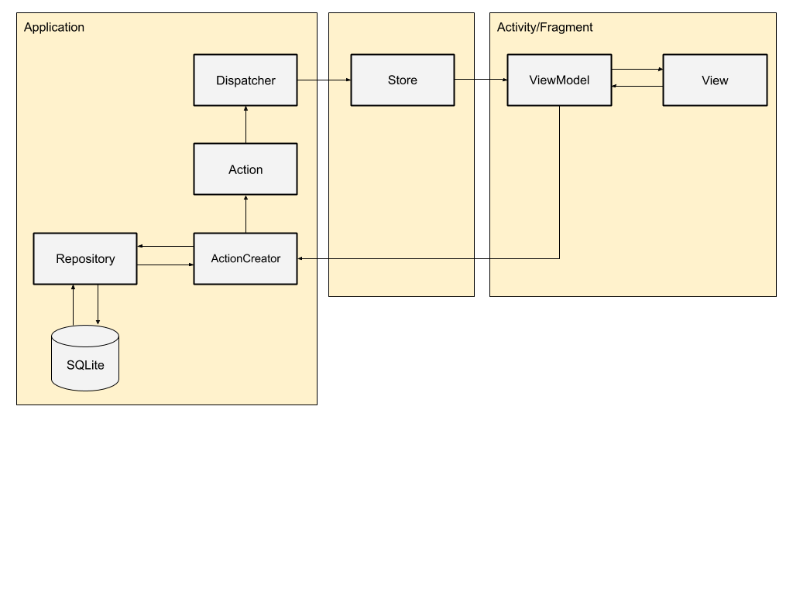

 

百人一首
========

[Google Play](https://play.google.com/store/apps/details?id=me.rei_m.hyakuninisshu)

## Environment
- language : Java -> Kotlin
- min sdk : 16

## Structure

- MVVM + Fluxな構成になっています。が、仕様に対して過剰な設計です。個人の設計の遊び場としても作っているのであまり参考にはしない方がいいと思います。

## Licence

[Apache License 2.0](LICENCE.txt)

## Author

[rei-m](https://github.com/rei-m)
